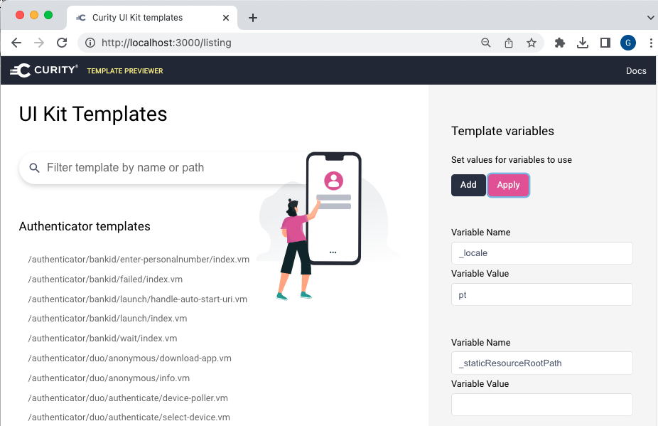
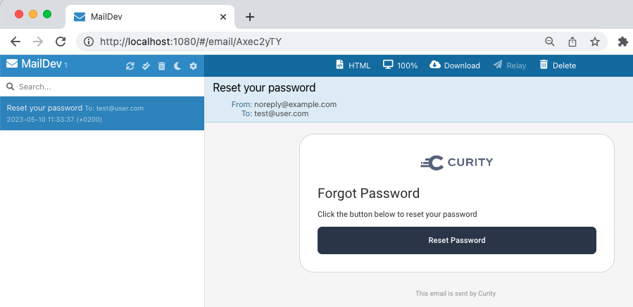

# Curity Identity Server Customization Recipes

[](https://curity.io/resources/code-examples/status/)
[](https://curity.io/resources/code-examples/status/)

A fast setup for running the common login customization use cases.\
Once understood, similar customizations can be quickly applied to your own system.

## Prerequisites

First ensure that the following components are installed locally:

- A [Docker](https://www.docker.com/) engine for your operating system
- The [envsubst](https://github.com/a8m/envsubst) tool, eg by running `brew install gettext`

## Run the UI Builder

First run the ui-builder tool, with a recipe to customize:

```bash
export RECIPE='basics'
./run-ui-builder.sh
```

This copies the files from the first recipe, then opens the UI builder at the customized page.\
You can see a list of all pages by browsing to the base URL of http://localhost:3000.  
In the following screenshot the language has been set to Portuguese:



## Example Recipes

Some example customizations are provided, in the below link, each of which has its own README file:

| Recipe Name | Description |
| ----------- | ----------- |
| [basics](recipes/basics) | Simple customizations to change text, logos and styles | 
| [email](recipes/email) | Customizations to email text, styles and templates, for email based login flows | 
| [multi-brand](recipes/multi-brand) | How to implement different branded customizations per client application |

## Deploy Customizations

Deploy the recipe files to the Curity Identity Server, using a command of this form:

```bash
export RECIPE='basics'
./deploy-idvr.sh
```

Login to the Admin UI if required, using these details, to understand the demo client and its authentication:

- URL: https://localhost:6749/admin
- Username: admin
- Password: Password1

The deployed system uses the `Username is Email` option from the Account Manager:


## Run OAuth Tools

Once the system is up and running, use OAuth tools to test deployed customizations.\
Run the desktop version of OAuth Tools and create an environment from this metadata URL:

```text
http://localhost:8443/oauth/v2/oauth-anonymous/.well-known/openid-configuration
```

Then run a code flow with a test client, and use the following settings in OAuth tools.\
Alternatively use `template-area` clients with a client ID of `web-client1` or `web-client2`.

- Client ID: web-client
- Client Secret: Password1
- Scope: openid
- Prompt: login

Select the `HTML Form` authenticator and use the `Create Account` option to register a new test user.\
Then authenticate as the user and also run `Reset Password` flows that trigger emails.\
View received emails by browsing to http://localhost:1080:



## Free Resources

Once you have finished customization testing, free resources by running this script:

```bash
./teardown.sh
````
