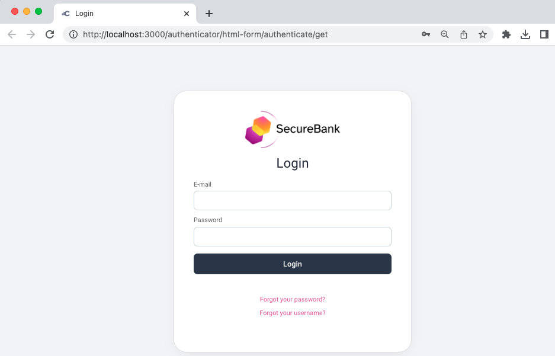
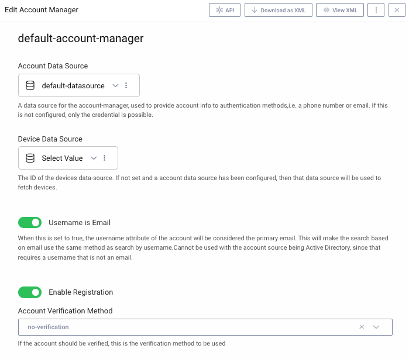
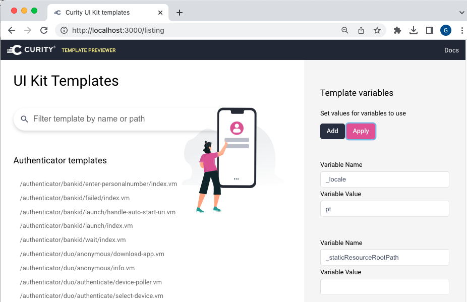
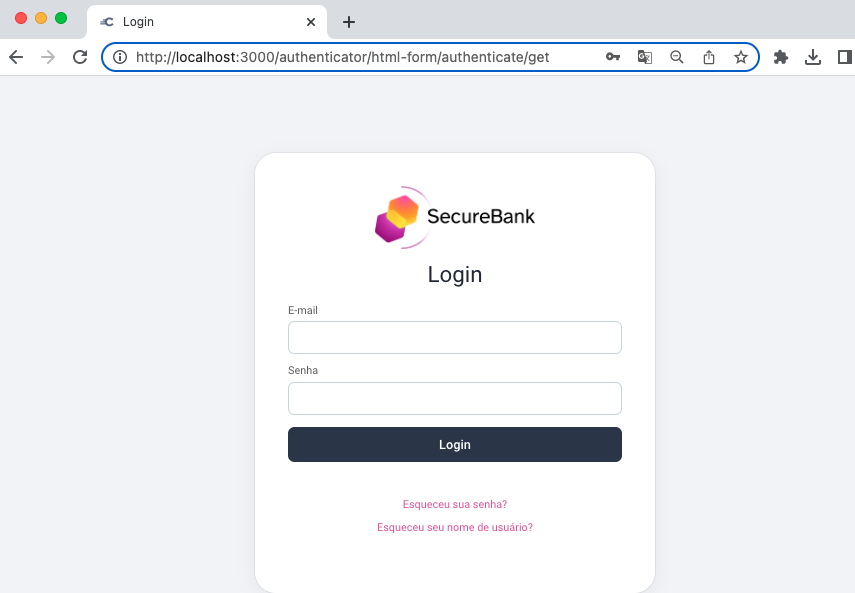
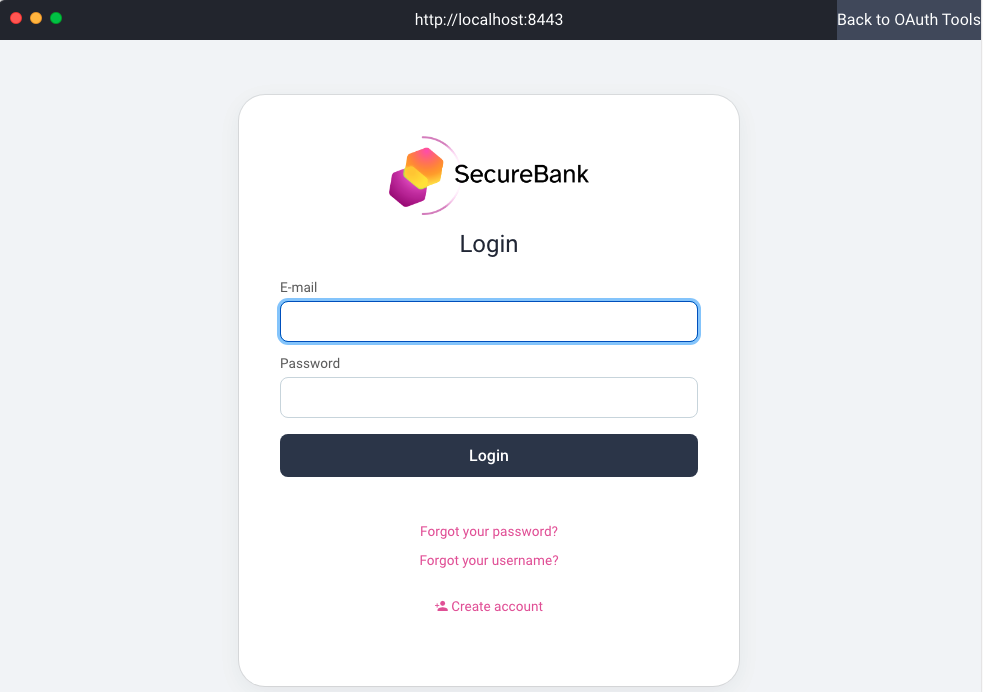

# Basic Customizations

This recipe shows how to implement basic customizations with the templating system.

## Custom Brand

When the UI builder is run, a simple branded login screen is shown.\
Updates to the `Settings.vm` file have removed some default UI elements:

The deployed system will use the `Username is Email` option in the Account Manager:

## UI Builder Development

You can browse to http://localhost:3000/listing to see a full list of screens and to set variables.\
The following sets the language to Portuguese:

The default username label has been updated to E-mail in all languages:

## Deploy and Test the Branding

When the system is deployed, you can quickly run a login with the same branding:

