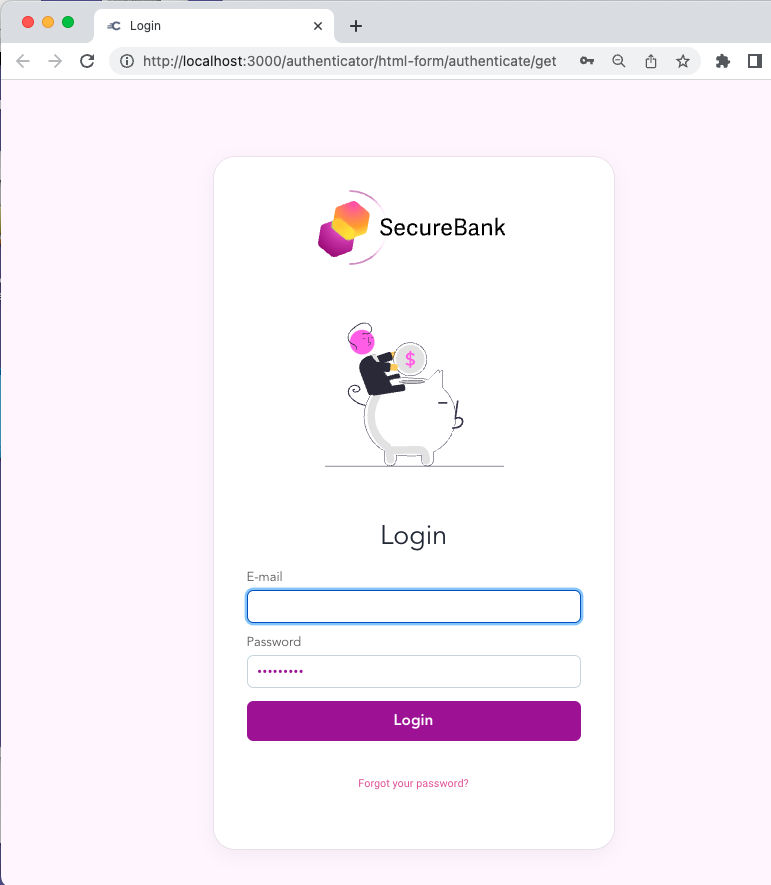

# Basic Customizations

This recipe shows how to implement basic customizations with the templating system.

## UI Builder Development

When the UI builder is run, a simple branded login screen is shown:

Updates to the `Settings.vm` file have removed some default UI elements.\
An `example-theme.scss` is also deployed, with customizations marked with a `CUSTOM`keyword.\
The default username label has been updated to E-mail in all languages:

## Deploy and Test the Branding

When the system is deployed, you can quickly run a login with the same branding:

