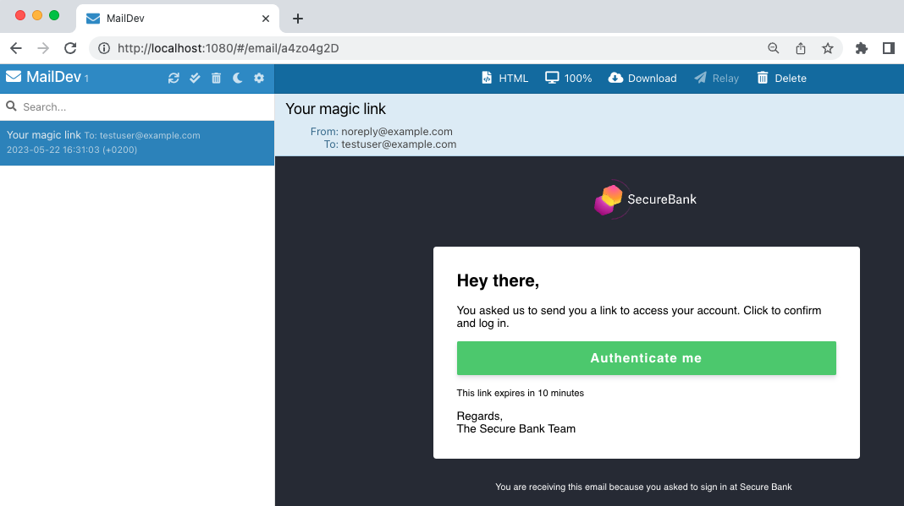

# Email Customizations

This recipe shows how to implement email customizations with the templating system.

## UI Builder Development

When the UI builder is run, a custom email template is shown when using the email authenticator:

## Deploy and Test the Branding

When the system is deployed, you can create a test user using the `Create Account` option on the HTML form.\
Then run an Email authentication flow to sign in with a magic link.\
Then browse to http://localhost:1080 to complete authentication byu clicking the link:

