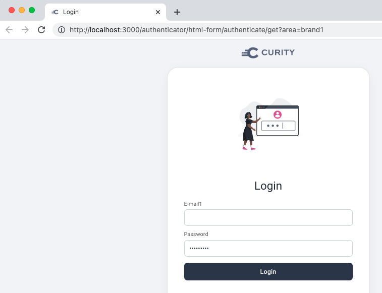
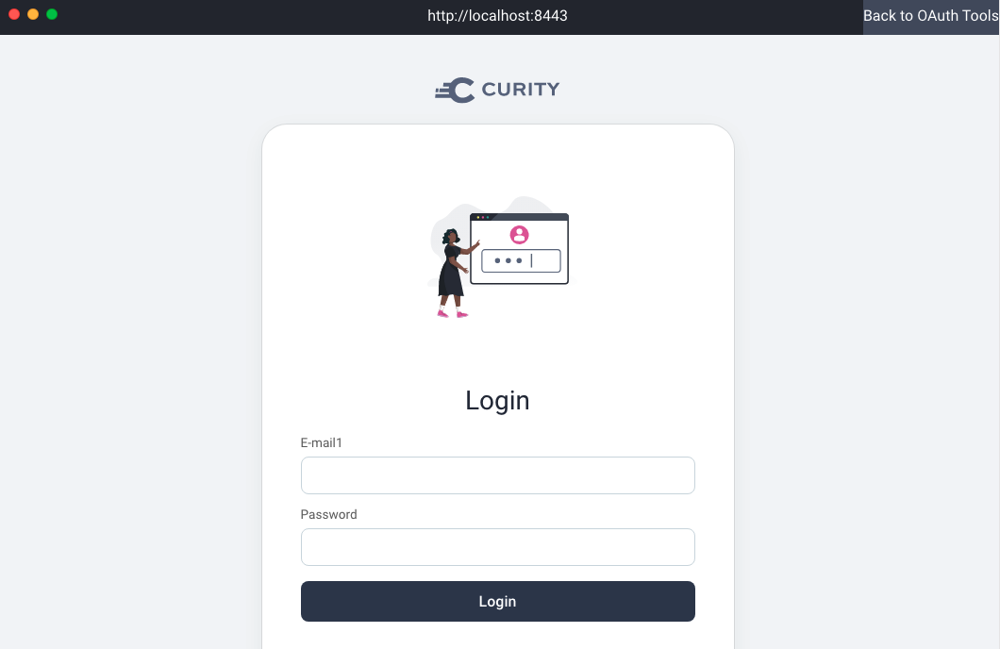
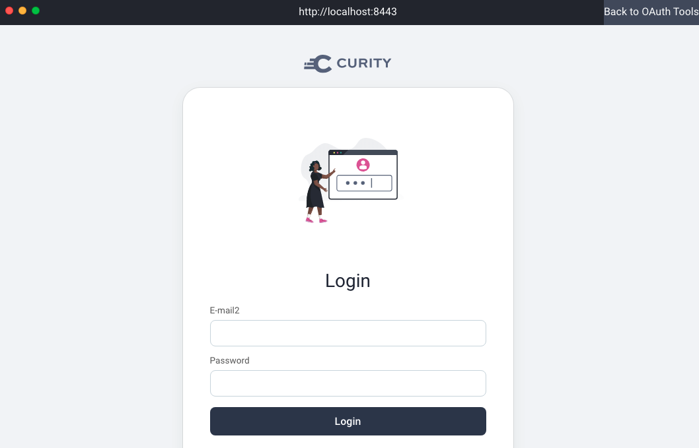

# Multi-Brand Customizations

This recipe shows how to implement multi-brand customizations with the templating system.

## UI Builder Development

When the UI builder is run, a custom email template is shown using a query parameter such as `area=?brand1`:

## Deploy and Test the Branding

When the system is deployed, brands are associated to clients:
- web-client1 uses template area `sb-group`
- web-client2 uses template area `sb-insurance`

Run a code flow in OAuth Tools for client 1 to see a custom username label:

Run a code flow in OAuth Tools flow for client 2 to see a different custom username label:

